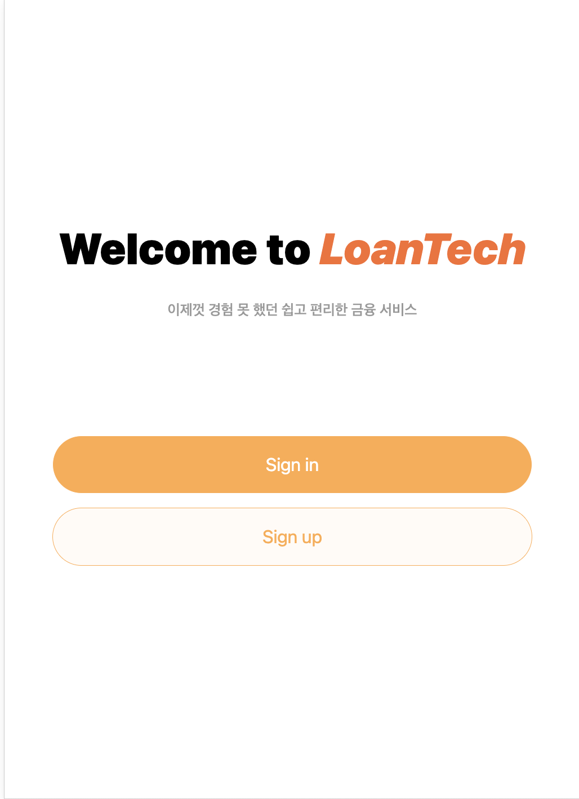

# mini-project-fe

api 명세: https://documenter.getpostman.com/view/25760000/2s935so2bC  
배포(develop): https://subtle-stardust-bdb90a.netlify.app/

## 라이브러리

- `react-icons` 아이콘 컴포넌트
- `react-loading` 로딩 컴포넌트
- `axios`
- `@tanstack/react-query`
- `redux` - 토큰관리
- `typescript`
- `react-router-dom`

## 페이지 및 기능



- `/` Home 페이지
  - 로그인 페이지 이동 버튼
  - 회원가입 페이지 이동 버튼
- `singup` 회원가입 페이지
  - 입력 폼: 이메일/ 패스워드/ 이름/나이/직업/거주지역/특기/취미
  - 회원가입 약관
  - 회원가입 확인 버튼 - "POST : api/auth/signup"
- `signin` 로그인 페이지
  - 입력폼: 이메일 / 패스워드
    - 로그인 버튼 - "POST : api/auth/signin"
  - 회원가입 페이지 이동 버튼 (route /signup )
- `/main` 메인 페이지(금융상품 목록) - "GET : api/products", "GET : api/products/recommends"
  - 신청 가능 대출금 총합
  - 대출 상품 목록 무한스크롤
  - 추천 상품 목록 무한스크롤(슬라이더)
- `/user` 개인 정보 페이지 - "GET : api/user"
  - 관심상품 리스트
  - 장바구니 상품 리스트
  - 신청한 대출상품 리스트
  - 정보 수정 페이지 이동 버튼
  - 회원 탈퇴
    - 회원 탈퇴 클릭시 컨펌모달창 띄움 : 예/아니오 - "DELETE : api/auth/signup"
- `user/edit` 개인정보 수정 페이지 - "GET api/auth/user"
  - 정보수정 form : 패스워드/이름/나이/직업/거주지/특기/취미/연봉
  - 확인 버튼 - "PUT api/user"
- `user/myCart` 장바구니 페이지 - "GET api/auth/user"
  - 구매한 상품 (카드형식 구매하기 버튼O)
  - 구매하기 버튼 - "POST api/products/financial/buy"
- `user/wishlist` 관심상품 페이지 - "GET api/auth/user"

  - 구매한 상품(카드형식 구매하기 버튼X)
  - 장바구니로 추가하기 버튼 - - "PUT api/auth/user"

- `products/financial` 금융상품페이지 -"GET api/products/financial"
  - 검색 form
    - 검색어 제출 - "GET api/products/financial"
  - 정렬 select 박스
  - 검색 리스트
- `products/financial/:financialId` 금융 상품 상세페이지 - "GET api/products/financial/:financialId"
  - 상품 이미지
  - 상품명
  - 간단한 description
  - 장바구니, 구매하기(신청하기), 관심상품(등록) 버튼
    - 구매하기 버튼시 모달창 띄움 : 신청하기 / 취소하기 - "POST api/products/financial/buy"

### +@ (추가?)

- `products/card` 카드 관련 페이지
  - 검색 input
  - 정렬 select 박스
  - 검색 리스트
- `products/card/:cardId` 금융 상품 상세페이지
  - 상품 이미지
  - 상품명
  - 간단한 description
  - 장바구니, 구매하기(신청하기), 관심상품(등록) 버튼
    - 구매하기 버튼시 모달창 띄움 : 신청하기 / 취소하기
- `products/membership` 멤버십 관련
  - 검색 input
  - 정렬 select 박스
  - 검색 리스트
- `products/memebership/:memebershipId` 멤버십 혜택 상세페이지
  - 상품 이미지
  - 상품명
  - 간단한 description
  - 장바구니, 구매하기(신청하기), 관심상품(등록) 버튼
    - 구매하기 버튼시 모달창 띄움 : 신청하기 / 취소하기

## API 요청

### API 요청 headers

- 모든 API 요청(request) headers 에 아래 정보가 꼭 포함돼야 합니다.

```json
{
  "content-type": "application/json",
  "apikey": "aQF1bDcFEF12fg78fp2PqFmcE13"
}
```

### 회원가입

- 사용자 비밀번호는 암호화하여 저장합니다.
- FE 는 약관에 동의할 경우 요청을 보냅니다.

```curl
curl BASE_URL/api/auth/signup
  \ -X 'POST'
```

요청 데이터 타입 및 예시:

```ts
interface RequestBody {
  email: string; // 사용자 아이디 (필수!)
  password: string; // 사용자 비밀번호, 8자 이상 (필수!)
  displayName: string; // 사용자 이름, 20자 이하 (필수!)
  age: number; // 나이 (필수!)
  job?: string; // 직업 (선택)
  location?: string; // 사는 곳 (선택)
  skills?: string[]; // 특기 (선택)
}
```

```json
{
  "email": "abcd12340@gmail.com",
  "password": "********",
  "displayName": "HongGilDong",
  "age": 25,
  "job": "개발자",
  "location": "서울/경기",
  "skills": ["코딩/개발", "글쓰기", "작곡/작사", "그림/디자인", "기획/아이디어"]
}
```

응답 데이터 타입 및 예시:

```ts
interface ResponseValue {
  user: {
    // 회원가입한 사용자 정보
    userId: string; // 사용자 ID
    email: string; // 사용자 이메일
    displayName: string; // 사용자 표시 이름
    age: number; // 나이
    job: string | null; // 직업
    location: string | null; // 지역
    skills: string[]; // 특기
    wishlist: string[]; // 관심상품 목록
    myCart: string[]; // 장바구니
    status: {
      creditScore: number; // 신용점수
      assets: IAssets; // 자산관련
      loan: ILoan[]; // 대출관련
    };
  };
  accessToken: string; // 사용자 접근 토큰
}
```

```json
{
  "user": {
    "userId": "Mq2KKHk8vlmr6Xkg58Fa",
    "email": "abcd12340@gmail.com",
    "password": "********",
    "displayName": "HongGilDong",
    "age": 25,
    "job": "개발자",
    "location": "서울/경기",
    "skills": [
      "코딩/개발",
      "글쓰기",
      "작곡/작사",
      "그림/디자인",
      "기획/아이디어"
    ],
    "wishlist": ["adbDasdfd1d91FD", "Fdf19dfkcfddfasd"], // 관심상품 목록
    "myCart": ["dfoD@12fdVdasdfad"], // 장바구니
    "status": {
      "creditScore": 999,
      "assets": {
        // 자산
      },
      "loan": {
        // 대출
      }
    }
  },
  "accessToken": "ey81cdciOiJIUzI1NiIs12CDfcCI6IkpXVCJ9.eyJpFID6IlM3FHepQ...(생략)"
}
```

### 로그인(signin)

- 발급된 `accessToken`은 24시간 후 만료됩니다.(만료 후 다시 로그인 필요)

```curl
curl https://BASE_API_URL/api/auth/signin
  \ -X 'POST'
```

요청 데이터 타입 및 예시:

```ts
interface RequestBody {
  email: string; // 사용자 아이디 (필수!)
  password: string; // 사용자 비밀번호 (필수!)
}
```

```json
{
  "email": "abcd12340@gmail.com",
  "password": "********"
}
```

응답 데이터 타입 및 예시:

```ts
interface ResponseValue {
  user: {
    // 회원가입한 사용자 정보
    userId: string;
    email: string; // 사용자 아이디
    displayName: string; // 사용자 표시 이름
    age: number; // 나이
    job: string | null; // 직업
    location: string | null; // 지역
    skills: string[] | null; // 특기
    wishlist: string[]; // 관심상품 목록
    myCart: string[]; // 장바구니
    status: {
      creditScore: number; // 신용점수
      assets: IAssets; // 자산관련
      loan: ILoan; // 대출관련
    };
  };
  accessToken: string; // 사용자 접근 토큰
}
interface IAssets {
  //
}
interface ILoan {
  //
}
```

```json
{
  "user": {
    "userId": "Mq2KKHk8vlmr6Xkg58Fa",
    "email": "abcd12340@gmail.com",
    "password": "********",
    "displayName": "HongGilDong",
    "age": 25,
    "job": "개발자",
    "location": "서울/경기",
    "wishlist": ["adbDasdfd1d91FD", "Fdf19dfkcfddfasd"], // 관심상품 목록
    "myCart": ["dfoD@12fdVdasdfad"], // 장바구니
    "skills": [
      "코딩/개발",
      "글쓰기",
      "작곡/작사",
      "그림/디자인",
      "기획/아이디어"
    ],
    "status": {
      "creditScore": 999,
      "assets": {
        // 자산
      },
      "loan": {
        // 대출
      }
    }
  },
  "accessToken": "ey81cdciOiJIUzI1NiIs12CDfcCI6IkpXVCJ9.eyJpFID6IlM3FHepQ...(생략)"
}
```

### 인증 확인

```curl
curl https://BASE_API_URL/api/auth/me
  \ -X 'POST'
  \ -H 'Authorization: Bearer <accessToken>'
```

요청 데이터 타입 및 예시:

-

응답 데이터 타입 및 예시:

```ts
interface ResponseValue {
  user: {
    // 회원가입한 사용자 정보
    userId: string;
    email: string; // 사용자 아이디
    displayName: string; // 사용자 표시 이름
    age: number; // 나이
    job: string | null; // 직업
    location: string | null; // 지역
    skills: string[] | null; // 특기
    status: {
      creditScore: number; // 신용점수
      assets: IAssets; // 자산관련
      loan: ILoan; // 대출관련
    };
  };
  accessToken: string; // 사용자 접근 토큰
}
```

```json
{
  "user": {
    "userId": "Mq2KKHk8vlmr6Xkg58Fa",
    "email": "abcd12340@gmail.com",
    "password": "********",
    "displayName": "HongGilDong",
    "age": 25,
    "job": "개발자",
    "location": "서울/경기",
    "wishlist": ["adbDasdfd1d91FD", "Fdf19dfkcfddfasd"],
    "myCart": ["dfoD@12fdVdasdfad"],
    "skills": [
      "코딩/개발",
      "글쓰기",
      "작곡/작사",
      "그림/디자인",
      "기획/아이디어"
    ],
    "status": {
      "creditScore": 999,
      "assets": {
        // 자산
      },
      "loan": {
        // 대출
      }
    }
  },
  "accessToken": "ey81cdciOiJIUzI1NiIs12CDfcCI6IkpXVCJ9.eyJpFID6IlM3FHepQ...(생략)"
}
```

### 로그아웃 (signout)

```curl
curl https://BASE_API_URL/api/auth/signout
  \ -X 'POST'
  \ -H 'Authorization: Bearer <accessToken>'
```

요청 데이터 타입 및 예시:

-

응답 데이터 타입 및 예시:

```ts
type ResponseValue = true; // 로그아웃 처리 상태
```

### 사용자 정보 수정

```curl
curl https://BASE_API_URL/api/auth/user
  \ -X 'PUT'
  \ -H 'Authorization: Bearer <accessToken>'
```

요청 데이터 타입 및 예시:

```ts
interface RequestBody {
  displayName?: string; // 새로운 표시 이름
  oldPassword?: string; // 기존 비밀번호
  newPassword?: string; // 새로운 비밀번호
  age?: number; // 새로운 나이
  job?: string | null; // 새로운 직업
  location?: string | null; // 새로운 지역
  skills?: string[] | null; // 새로운 특기
}
```

```json
{
  "oldPassword": "********",
  "newPassword": "**********"
}
```

응답 데이터 타입 및 예시:

```ts
interface ResponseValue {
  email: string; // 사용자 아이디
  displayName: string; // 사용자 표시 이름
  age?: number; // 새로운 나이
  job?: string | null; // 새로운 직업
  location?: string | null; // 새로운 지역
  skills?: string[] | null; // 새로운 특기
}
```

```json
{
  "email": "abcd1234@gmail.com",
  "displayName": "HongGilDong",
  "age": 25,
  "job": "개발자",
  "location": "서울/경기",
  "skills": ["코딩/개발", "글쓰기", "작곡/작사", "그림/디자인", "기획/아이디어"]
}
```

## 상품

### 모든 금융 상품 조회

```curl
curl https://BASE_API_URL/api/financial
  \ -X 'GET'
```

요청 데이터 타입 및 예시:

-

응답 데이터 타입 및 예시:

```ts
type ResponseValue = Financial[]; // 판매중인 모든 제품의 목록

interface Financial {
  // 상품 정보
  financialId: string; // 금융상품 ID
  title: string; // 제품 이름
  price: number | number[] | null; // 제품 가격
  type: 'loan' | 'investment' | 'deposit' | 'guaranteed'; // 금융상품의 종류: 대출or투자or예금or보장성
  tags: string[]; // 제품 태그
  provider: string; // 서비스 제공자
  image: string | null; // 상품 제공자 로고 or 이미지(URL)
}
```

```json
[
  {
    "financialId": "cFmeC7aY5KjZbBAdJE9y",
    "title": "경기도청 청년대출",
    "price": 1000000,
    "description": "청년 대출을 만나보세요 소득이 없거나 재직기간이 1년 미만인 직장인도 만 19-34세 무주택 청년이라면 대출신청이 가능합니다.",
    "type": "loan",
    "tags": ["청년", "경기도", "낮은 이자"],
    "provider": "경기도",
    "image": "https://image_url/cFmeC7aY5KjZbBAdJE9y.jpg"
  },
  {
    "financialId": "nbqtQvEivYwEXTDet7YM",
    "title": "주택청약종합저축",
    "price": null,
    "description": "주택마련의 시작! 매월 2만원 이상 50만원 이내에서 자유롭게 납입할 수 있으며, 납부한 총액이 1,500만원 도달 시 까지는 50만원 초과하여 자유적립 가능하며 국민주택, 민영주택 등 모든 주택 청약이 가능합니다",
    "type": "deposit",
    "tags": ["예금자보호", "세제혜택"],
    "provider": "하나은행",
    "image": "https://image_url/nbqtQvEivYwEXTDet7YM.jpg"
  }
]
```

### 단일 상품 상세 조회

```curl
curl https://BASE_API_URL/api/financial/:financialId
  \ -X 'GET'
```

요청 데이터 타입 및 예시:

-

응답 데이터 타입 및 예시:

```ts
interface ResponseValue {
  // 상품 정보
  financialId: string; // 금융상품 ID
  title: string; // 제품 이름
  price: number | null; // 제품 가격
  description: string; // 제품 설명
  type: 'loan' | 'investment' | 'deposit' | 'guaranteed'; // 금융상품의 종류: 대출or투자or예금or보장성
  tags: string[]; // 제품 태그
  provider: string; // 서비스 제공자
  image: string | null; // 상품 제공자 로고 또는 기타 이미지(URL)
}
```

```json
{
  "financialId": "nbqtQvEivYwEXTDet7YM",
  "title": "주택청약종합저축",
  "price": null,
  "description": "주택마련의 시작! 매월 2만원 이상 50만원 이내에서 자유롭게 납입할 수 있으며, 납부한 총액이 1,500만원 도달 시 까지는 50만원 초과하여 자유적립 가능하며 국민주택, 민영주택 등 모든 주택 청약이 가능합니다",
  "type": "deposit",
  "tags": ["예금자보호", "세제혜택"],
  "provider": "하나은행",
  "image": "https://image_url/nbqtQvEivYwEXTDet7YM.jpg"
}
```

### 상품 검색

- 상품 이름과 태그, 타입을 동시에 검색할 수 있고, 'And'(검색한 이름과 태그 모두 포함된 상품) 조건으로 결과를 반환합니다.
- 상품 이름과 태그와 타입 모두 포함하지 않으면, 모든 상품의 결과를 반환합니다.
- 상품의 기본 정보만 반환합니다.

```curl
curl https://BASE_API_URL/api/financial/search
  \ -X 'POST'
```

요청 데이터 타입 및 예시:

```ts
interface RequestBody {
  searchText?: string; // 검색할 상품 이름
  searchTags?: string[]; // 검색할 상품 태그
  searchType?: 'loan' | 'investment' | 'deposit' | 'guaranteed'; // 검색할 상품의 유형
}
```

```json
{
  "searchText": "대출",
  "searchTags": ["태그"]
}
```

응답 데이터 타입 및 예시:

```ts
type ResponseValue = Financial[]; // 관리하는 모든 제품의 목록

interface Financial {
  // 상품 정보
  financialId: string; // 금융상품 ID
  title: string; // 제품 이름
  price: number | null; // 제품 가격
  type: 'loan' | 'investment' | 'deposit' | 'guaranteed'; // 금융상품의 종류: 대출or투자or예금or보장성
  tags: string[]; // 제품 태그
  provider: string; // 서비스 제공자
  image: string | null; // 상품 제공자 로고 or 이미지(URL)
}
```

```json
[
  {
    "financialId": "nbqtQvEivYwEXTDet7YM",
    "title": "주택청약종합저축",
    "price": null,
    "description": "주택마련의 시작! 매월 2만원 이상 50만원 이내에서 자유롭게 납입할 수 있으며, 납부한 총액이 1,500만원 도달 시 까지는 50만원 초과하여 자유적립 가능하며 국민주택, 민영주택 등 모든 주택 청약이 가능합니다",
    "type": "deposit",
    "tags": ["예금자보호", "세제혜택"],
    "provider": "하나은행",
    "image": "https://image_url/nbqtQvEivYwEXTDet7YM.jpg"
  }
]
```

### 대출 신청

- 대출 신청시 신청 가능 대출금 총합에서 차감됩니다.
- 신청 가능 대출금 총합보다 대출 금액이 크면 대출 신청이 처리되지 않습니다.(에러 반환)

```curl
curl https://BASE_API_URL/api/products/financial/:financialId
  \ -X 'POST'
  \ -H 'Authorization: Bearer <accessToken>'
```

요청 데이터 타입 및 예시:

```ts
interface RequestBody {
  financialId: string; // 대출 상품 ID (필수!)
  accountId: string; // 결제할 사용자 계좌 ID (필수!)
}
```

```json
{
  "productId": "nbqtQvEivYwEXTDet7YM",
  "accountId": "Mq2KKHk8vlmr6Xkg58Fa"
}
```

응답 데이터 타입 및 예시:

```ts
type ResponseValue = true; // 거래 신청 처리 여부
```

### 제품 거래(구매) 취소

- 사용자 전용 API입니다.
- '취소'시 대출 가능 금액이 올라갑니다.

```curl
curl https://BASE_API_URL/api/financial/cancel
  \ -X 'POST'
  \ -H 'Authorization: Bearer <accessToken>'
```

요청 데이터 타입 및 예시:

```ts
interface RequestBody {
  financialId: string; // 취소할 상품의 거래 내역 ID
  userId: string; // 취소하는 유저의 userId
}
```

```json
{
  "financialId": "dMhfxyrAupQP18OYmywy",
  "userId": "Mq2KKHk8vlmr6Xkg58Fa"
}
```

응답 데이터 타입 및 예시:

```ts
type ResponseValue = true; // 거래 취소 처리 여부
```
